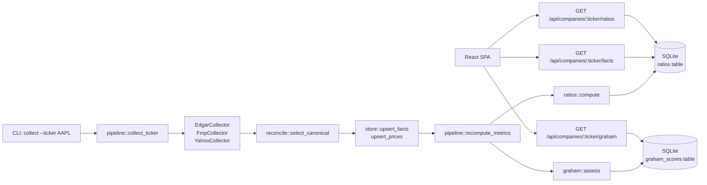

# Architecture

## Tech stack

| Layer | Technology |
|---|---|
| Backend language | Rust 1.91 |
| HTTP framework | Axum 0.7 + Tower middleware |
| Async runtime | Tokio |
| Database | SQLite (WAL mode) via sqlx |
| HTTP client | Reqwest with retry + rate-limit |
| Auth | Argon2 password hashing + bearer session tokens |
| Frontend | React 19 + Vite 8 + TypeScript |
| UI components | MUI v9 (dark-first theme) |
| Charts | ECharts (lazy-loaded canvas) |
| Tables | TanStack Table + DnD Kit |
| Frontend tests | Vitest + Testing Library |
| E2E tests | Playwright |

## Module map

```
backend/src/
  lib.rs          app() router: axum Router + body-limit/timeout/trace layers
  main.rs         CLI entry point (coverage-excluded): serve | bootstrap | collect | enrich | seed-admin
  config.rs       Env-driven Config struct (pure parse, no I/O side-effects)
  domain.rs       Typed models: Company, FinancialFact, Ratio, GrahamScore, etc.
  store.rs        SQLite CRUD, range queries, Parquet export; holds LoginThrottle
  api.rs          Axum REST handlers + AuthUser extractor; brute-force throttle
  auth.rs         Password hashing (Argon2) + session token helpers (pure)
  ratios.rs       Derived ratios per period — pure, no I/O
  graham.rs       Graham defensive scorecard, Graham Number, NCAV — pure, no I/O
  reconcile.rs    Canonical source selection + discrepancy flagging — pure, no I/O
  pipeline.rs     Ingest orchestration: collect_all, collect_ticker, recompute_metrics
  scheduler.rs    Tiered cron expressions; best-effort run_tracked
  net.rs          RetryPolicy + RateLimiter + LoginThrottle (time-injected, testable)
  http.rs         Reqwest client with retry + rate-limit (coverage-excluded glue)
  collectors/
    edgar.rs      SEC EDGAR companyfacts + ticker universe
    fmp.rs        Financial Modeling Prep (prices + income facts)
    yahoo.rs      Keyless Yahoo Finance chart API (prices)
    news.rs       Yahoo headline RSS + Finnhub news
    scrape.rs     HTML scrape fallback for gap-fill
```

## Data flow



## Request lifecycle

```
Client → Axum router
  → body-limit middleware (16 KB max)
  → timeout middleware (30 s)
  → trace middleware (structured logging)
  → handler (extracts AuthUser from Bearer token)
  → Arc<Store> (SQLite pool, WAL, max 16 connections)
  → JSON response
```

## Coverage gates

- **Backend**: `cargo llvm-cov` — 100% functions, ≥99% lines (phantom async artifact). `main.rs` and `http.rs` excluded (I/O glue).
- **Frontend**: Vitest — 100% statements / branches / functions / lines. `charts/` excluded (ECharts canvas wrappers).

## Key design constraints

- All logic in `lib.rs` tree; `main.rs` stays a thin dispatch wrapper.
- Collectors are behind trait interfaces (`FactSource`, `PriceSource`, `NewsSource`, `ProfileSource`) so they can be swapped with fakes in tests.
- Reconcile + ratios + Graham modules are pure (no I/O, inject clock).
- EDGAR is canonical: it wins conflicts; discrepancies above threshold are flagged.
- No live network calls in unit/integration tests — recorded fixtures only.
